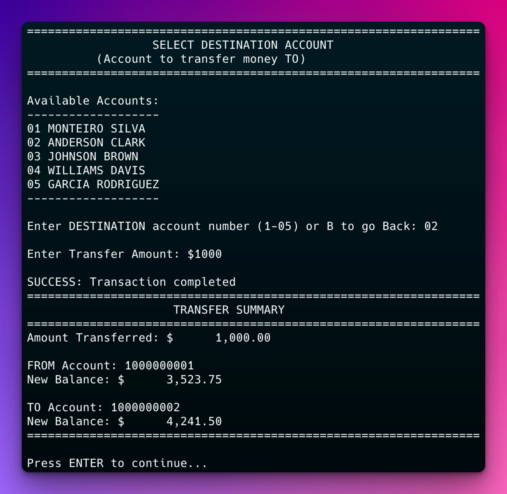

# COBOL Bank Ledger System

A COBOL bank ledger system demonstrating classic mainframe-style banking. This system simulates a bank teller workstation.



## Features

### Core Banking Operations

- **Account Management**: Create new accounts with complete customer information
- **Account Information**: View account details with integrated transaction history
- **Deposits & Withdrawals**: Process monetary transactions with balance updates
- **Transfers**: Move funds between accounts
- **Transaction History**: Complete audit trail with dates, descriptions, and amounts

### Technical Features

- **Data Persistence**: Indexed files for accounts, sequential files for transactions
- **Sample Data**: Pre-populated with 5 accounts and realistic transaction history
- **Easy Reset**: Single command to reset database to baseline state
- **Error Handling**: Clear status messages for all operations

## Prerequisites

### Install GnuCOBOL on macOS

1. Install Homebrew (if not already installed):

   ```bash
   /bin/bash -c "$(curl -fsSL https://raw.githubusercontent.com/Homebrew/install/HEAD/install.sh)"
   ```

2. Install GnuCOBOL:

   ```bash
   brew install gnu-cobol
   ```

3. Verify installation:
   ```bash
   cobc --version
   ```

### Additional Dependencies

GnuCOBOL may require additional libraries:

```bash
brew install gmp berkeley-db
```

## Project Structure

```
ledger-cobol/
├── src/               # Main COBOL source files
│   └── BANKLED.cob    # Main program with all functionality
├── copybooks/         # Reusable data structures
│   ├── ACCOUNT.cpy    # Account record definition
│   ├── TRANS.cpy      # Transaction record definition
│   └── COMMON.cpy     # Common constants and messages
├── data/              # Data files (created on first run)
│   ├── accounts.dat   # Indexed account master file
│   └── trans.dat      # Sequential transaction log
├── scripts/           # Utility scripts
│   └── reset-db.sh    # Database reset script
├── bin/               # Compiled executables (created on build)
├── Makefile           # Build system
```

## Quick Start

1. **Build the application**:

   ```bash
   make build
   ```

2. **Reset database with sample data**:

   ```bash
   make reset
   ```

3. **Run the application**:
   ```bash
   make run
   ```

## Usage

The system presents a traditional mainframe-style menu interface:

### Main Menu Options

1. **Create New Account** - Add new customer accounts

   - Enter customer details (name, address, phone)
   - Choose account type (Checking/Savings)
   - Automatically assigns next available account number

2. **Account Information** - View comprehensive account details

   - Select account from numbered list
   - Displays account holder information
   - Shows current balance in highlighted box
   - Lists transaction history with dates and descriptions

3. **Deposit** - Add funds to account

   - Select account using intuitive interface
   - Enter deposit amount
   - Updates balance immediately

4. **Withdrawal** - Remove funds from account

   - Select account with validation
   - Ensures sufficient funds before processing
   - Updates balance and logs transaction

5. **Transfer** - Move funds between accounts

   - Clear prompts for source account (FROM)
   - Separate prompt for destination account (TO)
   - Displays comprehensive summary with both account balances

6. **Exit** - Close application safely

## Commands

### Build Commands

```bash
make build      # Compile the application
make clean      # Remove build artifacts
make debug      # Build with debug information
```

### Runtime Commands

```bash
make run        # Run the application
make reset      # Reset database to baseline with sample data
make init-data  # Initialize empty data files
```

### Development Commands

```bash
make test       # Run unit tests
make check-deps # Verify GnuCOBOL installation
```

## Troubleshooting

### Common Issues

1. **File Status Errors**

   - Status 22: Usually indicates duplicate key or file attribute mismatch
   - Status 39: File attribute mismatch between create and read
   - Solution: Run `make reset` to ensure consistent file structures

2. **Berkeley DB Warnings**

   - "unexpected file type or format" warnings are normal
   - The application handles these gracefully

3. **Account Creation Issues**
   - New accounts start at 1000000006 (after the 5 sample accounts)
   - Ensure you run `make reset` if you get duplicate key errors

## Development Notes

- Uses GnuCOBOL's free format (-free flag)
- Follows COBOL 2014 standard
- Traditional COBOL programming patterns with modern enhancements
- All business logic contained in single source file for simplicity
- Copybooks provide shared data structures
- No external dependencies beyond GnuCOBOL runtime

## Contributing

Feel free to submit issues or pull requests to improve the system.

## License

This project is licensed under the MIT License - see the [LICENSE](LICENSE) file for details.
